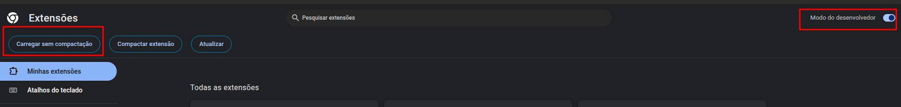
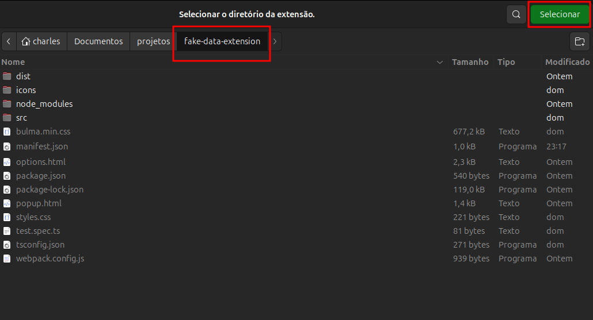
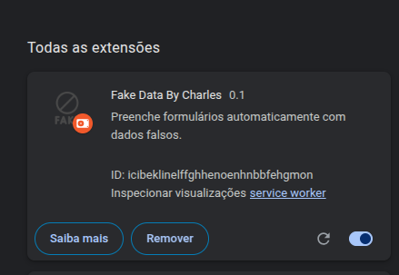
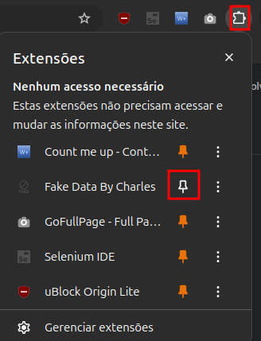
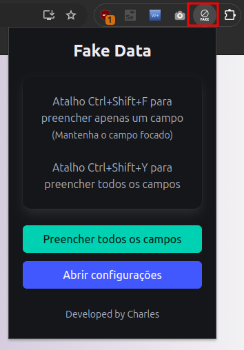
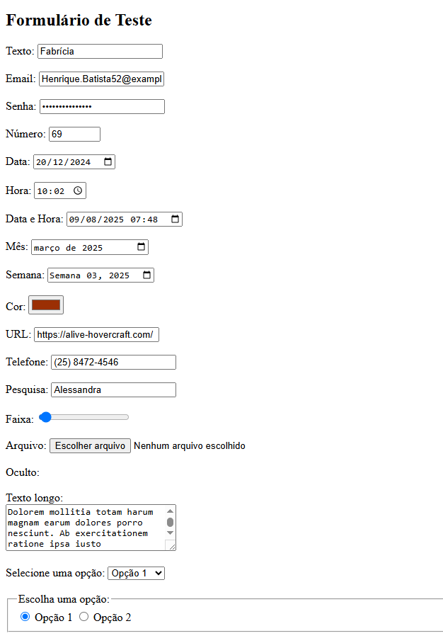

# Faker Data By Charles

## Passo a Passo

## Faça o clone do projeto

## 1. Habilitar modo desenvolvedor e carregar extensão

## 2. Selecionar a pasta da extensão

## 3. Importação realizada com sucesso

## 4. Fixar a extensão

## 5. Extensão instalada

## 6. Extensão em uso

## Projeto construído para todos QA!

Fique a vontade para apontar melhorias ou até mesmo atuar como colaborador projeto!
